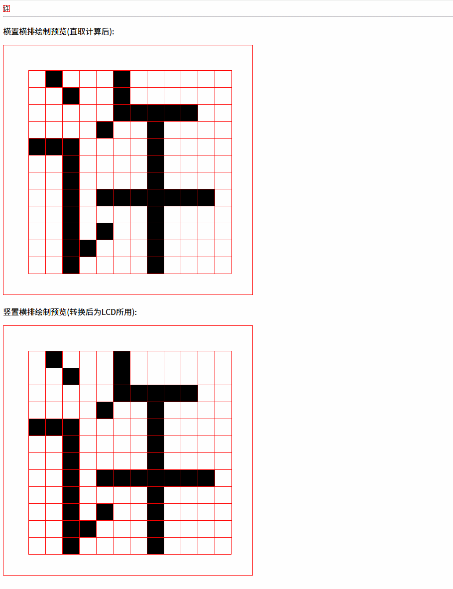
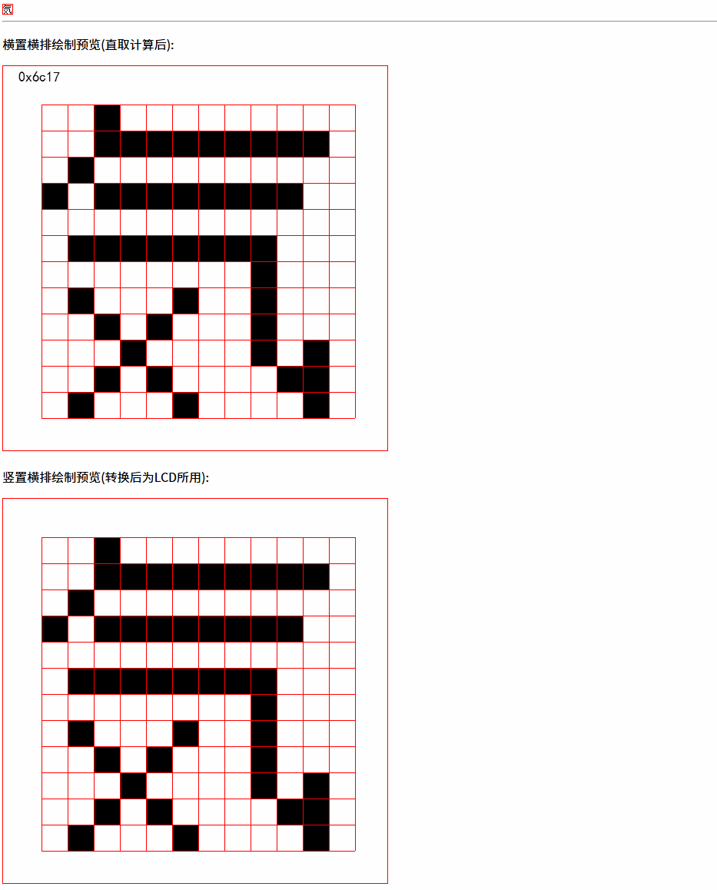
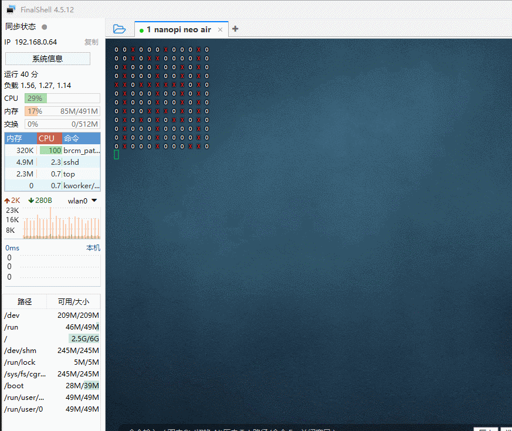
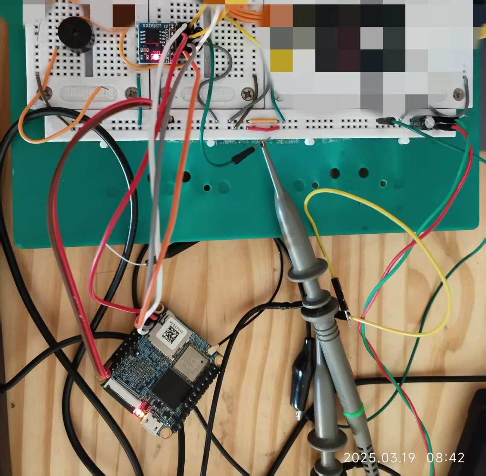

# 字库点阵生成思路验证   

<details>
<summary>缘由起因</summary>
狗日的某通字库，简直垃圾。一块字库2块钱，文档里连起始地址和偏移等计算的参数都不给，加官方群立马就有人来加你，得知不是欲买东西的客户，直接就不回复了。   
该字库IC总共2条指令，官网会引导让下载安装他们家web兮兮的AI工具桌面端才能获取链接库，还要手机号一顿注册... 就2个接口的读取，如此麻烦！恶心恶心恶心...   

最后决定自己生成中文点阵数据，建立unicode索引把数据放到flash读取来实现字库的功能。摆在首位的就是如何获取CJK表意文字的点阵，最终思路验证ok。    
</details>

---

字库的实现，使用web生成字库点阵，生成需要的unicode码点范围的字符取模数据，按照`FFBF`格式存放，利用spidev烧写到Flash芯片，供硬件LCD使用！  

> FFBF格式（Freeman Font Lib Format）即自定义中间格式，用于web生成点阵数据与c编写spi写入flash之间协同。  
在没有想好如何优雅封装前先实现功能为首要！   
格式:
```text
# 这是注释, 一个FFBF文件内，可以有多段不同的unicode范围的数据，他们以`W`开头的描述行来做分割，清参考下面的解释`   
W<宽点数>,H<高点数>,S<起始unicode范围>,E<结束unicode范围>
<高4bit表示起始列，低4bit表示有效宽度点>,x,x,x,x,x,
```

后面改为上位机来实现，使用CH347或者FT2232H外加烧录夹来实现！目前为了省钱（因为穷）,拆下别的设备上的linux核心板，利用开发板的spi接口进行烧录！ 


* 取模视图   
       

* 高速取模    
    

* falsh写入成功，字库读取验证   
     

* 硬件连接  
     